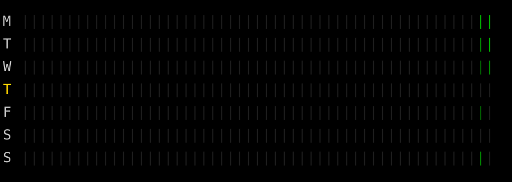

# git-year

A minimal and compact terminal heatmap that shows one full **year** of Git commits in a GitHub-style layout, using vertical bars instead of squares to fit comfortably in small terminal windows.

This tool offers a clean, lightweight, zero-dependency CLI contribution calendar for developers who want a quick visual overview of their Git activity directly from the command line.

---

## Features

- **Shows the past year of commit activity** (today back to the same date last year) for the current Git repo
- **Similar to GitHub’s contribution graph**, but runs directly in your terminal
- **Jump to any calendar year** with `--year 2024` (auto-stops at today if the year is still in progress)
- **Choose Sunday or Monday as the calendar week start** with `--week-start Monday` (default: Sunday) and keep the preference across reboots
- **Green intensity gradient** based on commit volume
- **Compact vertical bars (`|`)** instead of large squares — fits even tiny terminals
- **Zero dependencies** (pure Python + Git)
- **256-color ANSI output** with dark-mode-friendly palette
- **Highlights the current weekday**
- Works in **macOS, Linux, Windows Terminal, VS Code terminal, Git Bash**
- Graceful message if run outside a Git repo
- Ready for PyPI (`pip install git-year`)

---

## Installation

```
pip install git-year
```

If pip is not installed – install it before:
```
python -m ensurepip --upgrade (Windows)
python3 -m ensurepip --upgrade (macOS/Linux)
```

---

## Usage

Run `git-year` inside any Git repository to display a one-year contribution heatmap in your terminal.
```bash
git-year
# outputs a GitHub-style contribution heatmap (shown as vertical bars)
```

You’ll see a compact 7×52 bar heatmap representing your activity for the past year up to today, displayed in dark mode with retro-style green bars highlighting your commit days (the week can start on either Monday or Sunday).

<p align="center">
  
</p>

- Rows = weekdays (Sun-Sat)
- Columns = weeks (52 total) covering the trailing year’s timeline (same date last year → today)
- Color intensity = commit count
- The current day label is highlighted in yellow

Choose the start of the week (case-insensitive, saved to `~/.config/git-year/config.toml` on Linux/macOS or `%APPDATA%\git-year\config.toml` on Windows):
```
git-year --week-start Sunday (or S, Su, Sun)
git-year --week-start Monday (or M, Mo, Mon)
```

Focus on a specific calendar year (Jan 1 → Dec 31, or today if it’s still the current year):
```
git-year --year 2024
```

When you try to peek into a future year you’ll get a playful message ;)

Show the installed version:
```
git-year -V
git-year --version
```

Need a refresher on the available options?
```
git-year -h
git-year --help
```

---

## Requirements

- Python 3.8+
- Git available in PATH
- A terminal with ANSI color support (all modern terminals)
- On legacy cmd.exe ANSI colors may fall back to monochrome

---

## Contributing

Contributions are welcome!
Ideas, issues, and pull requests are appreciated.

---

## License

MIT License
Copyright (c) 2025 Serge Velbovets

---

Enjoy your terminal-native Git activity graph without leaving the shell — **git-year** keeps your development rhythm visible, simple, and elegant.
